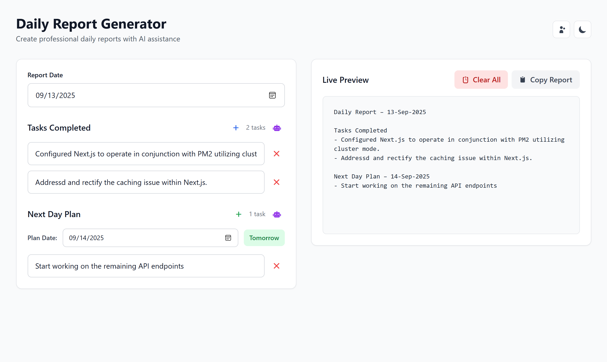

# Daily Report Generator

A modern, AI-powered web application for creating professional daily reports with ease. Built with vanilla HTML, CSS, and JavaScript, featuring a clean interface and intelligent task rewriting capabilities.

## ✨ Features

- **📝 Daily Task Management**: Add, edit, and organize completed tasks
- **📅 Next Day Planning**: Plan and schedule tasks for upcoming days
- **🤖 AI-Powered Rewriting**: Rewrite tasks in different tones (formal, casual, professional, concise, detailed)
- **🌙 Dark/Light Mode**: Toggle between themes for comfortable viewing
- **💾 Local Storage**: Automatically saves your data locally
- **📋 One-Click Copy**: Copy formatted reports to clipboard
- **📱 Responsive Design**: Works seamlessly on desktop and mobile devices
- **⚡ Real-time Preview**: See your report format instantly as you type

## 🚀 Demo



*A clean, modern interface with dark/light mode support and AI-powered task rewriting*

## 🛠️ Technologies Used

- **Frontend**: HTML5, CSS3 (Tailwind CSS), Vanilla JavaScript
- **Icons**: Font Awesome 6.4.0
- **AI Integration**: OpenRouter API with Qwen 2.5 Coder model
- **Storage**: Browser Local Storage

## 📦 Installation

1. **Clone the repository**
   ```bash
   git clone https://github.com/Naimur444/daily-report-generator.git
   cd daily-report-generator
   ```

2. **Open the application**
   ```bash
   # Simply open index.html in your browser
   open index.html
   # or
   python -m http.server 8000  # For a local server
   ```

3. **Configure AI Features (Optional)**
   - Get an API key from [OpenRouter](https://openrouter.ai/)
   - Click the AI configuration button in the app
   - Enter your API key to enable AI rewriting features

## 🔧 Usage

### Basic Usage
1. **Set Date**: Choose your report date
2. **Add Tasks**: Click the ➕ icon to add completed tasks
3. **Plan Ahead**: Add tasks for the next day
4. **Copy Report**: Use the "Copy Report" button to get formatted text

### AI Features
1. **Configure API**: Click the gear icon and add your OpenRouter API key
2. **Rewrite Tasks**: Click the 🤖 AI button next to any section
3. **Choose Style**: Select from formal, casual, professional, concise, or detailed tones
4. **Wait for Magic**: Watch the loading animation as AI rewrites your tasks

### Keyboard Shortcuts
- **Enter**: Add new task (when focused on input)
- **Escape**: Close AI menus

## 🎨 Customization

The application uses Tailwind CSS for styling. You can customize:

- **Colors**: Modify the color scheme in the HTML classes
- **Animations**: Adjust the CSS animations in the `<style>` section
- **Layout**: Change the grid layout and spacing

## 📱 Mobile Support

The application is fully responsive and works great on:
- 📱 Mobile phones
- 📟 Tablets  
- 💻 Desktop computers
- 🖥️ Large screens

## 🔒 Privacy & Security

- **Local Storage**: All data is stored locally in your browser
- **No Server**: No data is sent to external servers (except for AI features)
- **API Security**: OpenRouter API key is stored locally and never shared
- **Open Source**: Full source code is available for review

## 🤝 Contributing

Contributions are welcome! Please feel free to submit a Pull Request.

1. Fork the project
2. Create your feature branch (`git checkout -b feature/AmazingFeature`)
3. Commit your changes (`git commit -m 'Add some AmazingFeature'`)
4. Push to the branch (`git push origin feature/AmazingFeature`)
5. Open a Pull Request


## 📄 License

This project is licensed under the MIT License - see the [LICENSE](LICENSE) file for details.

---

**Made with ❤️ by [Naimur Rahman](https://github.com/Naimur444)**

⭐ Star this repository if you find it useful!